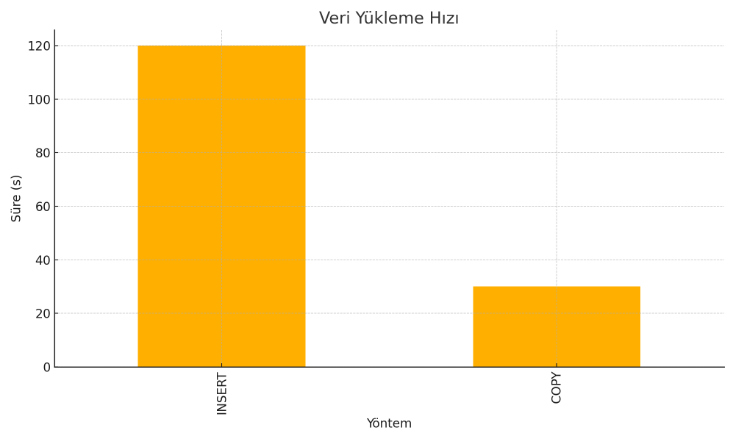
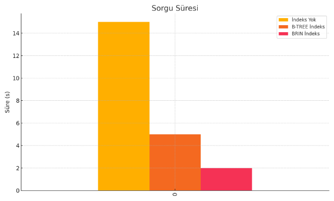
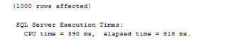
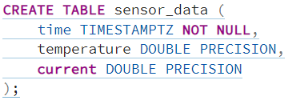
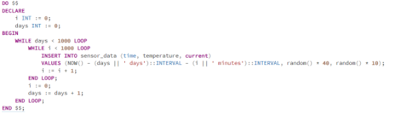
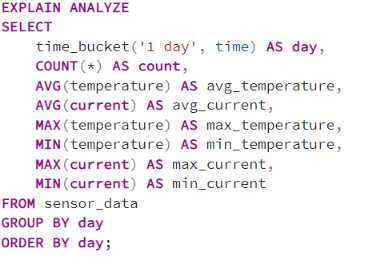

# **PLC Haberleşmesi için PostgreSQL TimescaleDB Kullanımı**
## **Giriş**
PLC (Programmable Logic Controller) sistemleri, endüstriyel otomasyon ve kontrol süreçlerinde kritik bir rol oynar. Bu sistemlerin etkin ve hızlı veri işleme gereksinimleri, performanslı ve ölçeklenebilir bir veritabanı çözümüne ihtiyaç duyar. PostgreSQL’in Timescale eklentisi, zaman serisi verilerinin yönetimi ve analizi konusunda sunduğu özellikler ile bu gereksinimleri karşılamak için ideal bir çözümdür.
## **PostgreSQL TimescaleDB Nedir?**
TimescaleDB, açık kaynaklı PostgreSQL veritabanı üzerinde çalışan bir zaman serisi veritabanı eklentisidir. Zaman serisi verilerini yönetmek ve analiz etmek için optimize edilmiştir. Endüstriyel IoT, finans, enerji yönetimi gibi alanlarda yoğun olarak kullanılan bu eklenti, büyük ölçekli zaman serisi verilerini etkin bir şekilde saklama ve sorgulama yetenekleri sunar.
## **TimescaleDB'nin Avantajları**
- Yüksek Performanslı Zaman Serisi İşleme: TimescaleDB, zaman serisi verilerini depolama ve sorgulama işlemlerinde yüksek performans sunar. Verilerin hızlı bir şekilde yazılması ve okunması için optimize edilmiştir.
- Sıkıştırma ve Veri Saklama: TimescaleDB, veri sıkıştırma algoritmaları ile disk kullanımını optimize eder. Bu sayede büyük miktarda veri saklanabilir ve saklama maliyetleri düşer.
- Otomatik Veri Bölümlendirme: TimescaleDB, veriyi otomatik olarak zaman dilimlerine böler (partitioning). Bu, veritabanı performansını artırır ve büyük veritabanlarının yönetimini kolaylaştırır.
- SQL Desteği: PostgreSQL üzerine kurulu olduğu için, TimescaleDB standart SQL sorgularını destekler. Mevcut PostgreSQL kullanıcıları için öğrenme eğrisi düşüktür ve mevcut araçlarla uyumludur.
- Yatay ve Dikey Ölçeklenebilirlik: TimescaleDB, hem yatay (horizontal) hem de dikey (vertical) ölçeklenebilirlik sağlar. Veri miktarının ve sorgu yükünün arttığı durumlarda sistemin ölçeklenebilmesi büyük avantaj sağlar.
- Gerçek Zamanlı Analiz: TimescaleDB, gerçek zamanlı veri analizi ve görselleştirme için optimize edilmiştir. Bu özellik, PLC sistemlerinin anlık verilerini hızlı bir şekilde analiz etmeyi ve gerekli aksiyonları almayı kolaylaştırır.
## **PLC Haberleşmesinde TimescaleDB'nin Uygunluğu**
- Büyük Veri İşleme: TimescaleDB, büyük miktarda zaman serisi verisini etkin bir şekilde işleyebilir ve saklayabilir. Bu, PLC sistemlerinden gelen yoğun veri akışını yönetmek için idealdir.
- Hızlı Sorgulama ve Raporlama: TimescaleDB, verilerin hızlı bir şekilde sorgulanmasına ve raporlanmasına olanak tanır. Bu, sistemlerin performansını izlemek ve optimize etmek için kritik öneme sahiptir.
- Gerçek Zamanlı Performans İzleme: PLC sistemlerinden gelen verilerin gerçek zamanlı olarak izlenmesi ve analiz edilmesi gerektiğinde, TimescaleDB'nin gerçek zamanlı analiz yetenekleri büyük avantaj sağlar.
- Uyumluluk ve Entegrasyon: PostgreSQL tabanlı olduğu için, mevcut PostgreSQL altyapılarıyla kolayca entegre edilebilir. Bu, mevcut sistemlerinizi dönüştürmeden TimescaleDB'yi kullanmanıza olanak tanır.
## **PostgreSQL ve TimescaleDB Performans Ayarları**
PostgreSQL ve TimescaleDB’nin performansını artırmak için aşağıdaki ayarları ve teknikleri kullanabilirsiniz. Bu öneriler, https://www.timescale.com/blog/13-tips-to-improve-postgresql-insert-performance/ linkindeki öneriler temel alınarak hazırlanmıştır.

- Veritabanı Ayarları:
- Veri Yükleme ve Sıkıştırma:
- Veri Bölümlendirme (Partitioning):
- Dizinleme ve İndeksler:
### **Veritabanı Ayarları**
- ```shared_buffers:``` *Bellek yönetimi için önemli bir ayardır. Genel olarak toplam sistem belleğinin %25'i olarak ayarlanabilir.*
- ```work_mem:``` *Büyük sorgular için ayrılan bellek miktarını belirler. Bu ayar, karmaşık sorgularda performansı artırabilir.*
- ```maintenance_work_mem:``` *Bakım işlemleri için ayrılan bellek miktarını belirler. VACUUM ve CREATE INDEX işlemleri için kullanılır.*
- ```effective_cache_size:``` *Sistem belleğinin ne kadarının veritabanı için kullanılabileceğini belirler. Bu ayar, sorgu planlayıcısının daha iyi kararlar almasına yardımcı olur.*
___
### **Veri Yükleme ve Sıkıştırma**
- ```COPY``` Komutu Kullanımı: *Veri yüklemek için COPY komutunu kullanmak, INSERT komutuna göre daha hızlıdır.*
- ```Sıkıştırma Algoritmaları```: *TimescaleDB, veri sıkıştırma için çeşitli algoritmalar sunar. Bu algoritmalar, disk kullanımını azaltırken veri okuma hızını artırabilir.*
___
### **Veri Bölümlendirme (Partitioning)**
- ```Hypertable Kullanımı:``` TimescaleDB'nin hypertable özelliği, verileri otomatik olarak bölümlendirir. Bu, büyük veri setlerinde sorgu performansını önemli ölçüde artırır.
### **Dizinleme ve İndeksler**
- **Uygun İndekslerin Kullanımı:** Sorgu performansını artırmak için sık kullanılan kolonlara uygun indeksler oluşturun. Örneğin, zaman serisi verileri için zaman damgası (timestamp) kolonlarına indeks ekleyin.
- **Brin İndeksleri:** Büyük ve sürekli veri setleri için BRIN indeksleri kullanarak depolama ve sorgu performansını optimize edebilirsiniz.
___




### **Veri Yükleme Hızı**

Bu grafikte INSERT ve COPY komutları kullanılarak veri yükleme hızlarının karşılaştırılması görülmektedir. COPY komutu, INSERT komutuna göre önemli ölçüde daha hızlıdır.

___




### **Sorgu Süresi**

Bu grafikte, farklı indeks türlerinin sorgu süresine etkisi görülmektedir. BRIN indeksleri, büyük veri setlerinde en iyi performansı sağlamaktadır.

BRIN İndekslerinin PLC Haberleşmesinde Kullanımı
PLC (Programmable Logic Controller) haberleşmesi genellikle sürekli olarak veri toplar ve bu veriler genellikle zaman serisi verileridir. BRIN indeksleri, zaman serisi verileri ve büyük veri kümeleri için idealdir çünkü:

**Depolama Verimliliği:**

BRIN indeksleri, geleneksel B-tree indekslerine göre çok daha az depolama alanı kullanır.
Büyük veri kümeleri üzerinde çalışırken depolama alanını önemli ölçüde azaltır.
Sorgu Performansı:

BRIN indeksleri, büyük veri kümeleri üzerinde belirli aralıklarla yapılan sorgular için idealdir.
Verilerin zaman serisi verisi olduğu ve düzenli olarak zamanla arttığı düşünüldüğünde, BRIN indeksleri zaman bazlı sorgularda çok etkili olabilir.
Bakım Kolaylığı:

BRIN indeksleri, büyük veri kümeleri üzerinde daha az bakım gerektirir.
B-tree indekslerinin sürekli yeniden yapılandırılması gerekirken, BRIN indeksleri daha düşük bakım maliyetine sahiptir.

BRIN indeks oluşturma aşağıdaki gibidir.


###
###
###
###
___

### **PostreSQL Execution Tıme:**
Data içerisinde 1000 gün var ve her 1 günde 1000 adet kayıt var bunların ortalamasını,min,max değerleri PostreSQL üzerinde Index + Hypertable kullanıldığında resimdeki şekilde oluyor.


Aynı işlemleri MSSQL ile Index kullanarak yaptığımızda ise resimdeki gibi bir sonuç ile karşılaşıyoruz.



Bu durumda MSSQL ile PostreSQL + Timescale arasında yüksek miktarda zaman farkı çıkıyor. PostreSQL çok daha düşük bir zaman aralığında execute ederken MSSQL daha yüksek bir zaman aralığında execute ediyor. 

MSSQL ve PostgreSQL'in donanım kullanımı konusunda farklı yaklaşımları bulunmaktadır. MSSQL, donanım kaynaklarının kullanımında belirli sınırlamalar getiren bir yapıya sahiptir. Bu sınırlamalar genellikle lisanslama modeli ve kullanılan sürümle ilgilidir. Örneğin, MSSQL'in Standard Edition sürümü belirli miktarda RAM ve CPU çekirdeği ile sınırlıdır, bu da sistemin toplam performansını etkileyebilir. Kullanıcıların donanım kapasitelerini tam olarak kullanabilmeleri için daha yüksek lisans seviyelerine geçmeleri gerekebilir.

Öte yandan, PostgreSQL, donanım kaynaklarının kullanımında daha esnek bir yapıya sahiptir. PostgreSQL, kullanıcının donanım kaynaklarını tam kapasiteyle kullanabilmesine olanak tanır ve herhangi bir lisanslama sınırlaması getirmez. Bu esneklik, PostgreSQL'i büyük veri kümeleri ve yüksek performans gerektiren uygulamalar için ideal bir seçim haline getirir. Ayrıca, PostgreSQL üzerinde donanım kullanımı ile ilgili ince ayarlar yapabilir ve sistem performansını optimize edebilirsiniz. Bu özellik, PostgreSQL'i yüksek performans gerektiren uygulamalarda tercih edilen bir veritabanı yönetim sistemi yapar.


___


### **PostreSQL TimescaleDB + Hypertables**


TimescaleDB, PostgreSQL üzerinde zaman serisi verileri depolamak ve sorgulamak için optimize edilmiş bir veritabanı eklentisidir.
___




**time**: Zaman damgası (TIMESTAMPTZ), veri girişinin zamanını tutar.

**temperature**: double tipinde bir sayı olarak sıcaklık değerini tutar.

**current**: double tipinde bir sayı olarak akım değerini tutar.


___


Bu komut, sensor\_data tablosunu TimescaleDB hypertable'a dönüştürür.

- **Hypertable:** Zaman serisi verilerini daha verimli bir şekilde saklamak ve sorgulamak için optimize edilmiş bir yapıdır.
- **Parametreler:**

migrate\_data => true: Mevcut verileri hypertable'a taşır.
___

___

___
## **Örnek: Gelen Değeri Anlık Okuyup İşlem Yapma**
Örnek vermek gerekirse bir cihazdan gelen bir verinin bir değere ulaştıktan sonra sıfırlanıp tekrar başlamasını sağlayacak kod dizini.
___
**Hypertable Oluşturma**
```sql
CREATE TABLE trend_data (
    time TIMESTAMPTZ NOT NULL,
    value DOUBLE PRECISION NOT NULL
);

SELECT create_hypertable('trend_data','time');
```
**Geçici Toplama Tablosu**
Geçiçi toplamı ve geçerli count'u saklamak için bir tablo daha oluşturuyoruz.
```sql
CREATE TABLE temp_aggregate(
    id SERIAL PRIMARY KEY,
    current_sum DOUBLE PRECISION DEFAULT 0,
    current_count INTEGER DEFAULT 0,
    values JSONB DEFAULT '[]'::jsonb -- Verileri json şeklinde tutacağız gerektiği zaman erişmek için.
);

INSERT INTO temp_aggregate(current_sum, current_count, values) VALUES (0,0,'[]'::jsonb);
```
**Count Verilerini Saklayacak Tablo**
Her count işlemi tamamlandığında(ex:100 e ulaştığında) bu count'a ait verileri saklamak için bir tablo açıyoruz.
```sql
CREATE TABLE count_data (
    id SERIAL PRIMARY KEY,
    count_number INTEGER NOT NULL,
    start_time TIMESTAMPTZ NOT NULL,
    end_time TIMESTAMPTZ,
    values JSONB NOT NULL
);

SELECT create_hypertable('count_data','start_time');
```
**Fonksiyon Oluşturma**
Gelen veriyi toplayan, belirli bir eşiğe ulaştığında sayacı arttıran ve geçici toplamı(80 değerimiz var 25 geldi 100 ü aştığı için 5 i tutan) sıfırlayan fonksiyon
```sql
CREATE OR REPLACE FUNCTION update_count()
RETURNS TRIGGER AS $$
DECLARE
    total_sum DOUBLE PRECISION;
    current_count INTEGER;
    new_values JSONB;
    overflow DOUBLE PRECISION;
BEGIN
    -- Geçici toplamı ve geçerli count'u güncelle
    UPDATE temp_aggregate
    SET current_sum = current_sum + NEW.value,
        values = values || jsonb_build_array(ROW(NEW.time, NEW.value)::TEXT::JSONB)
    WHERE id = 1
    RETURNING current_sum, current_count, values INTO total_sum, current_count, new_values;

    -- Eğer toplam 100 veya daha büyükse
    IF total_sum >= 100 THEN
        -- Fazla değeri hesapla
        overflow := total_sum - 100;

        -- Geçerli count'u artır ve verileri sakla
        INSERT INTO count_data (count_number, start_time, end_time, values)
        VALUES (current_count + 1, (SELECT start_time FROM trend_data ORDER BY time LIMIT 1), NEW.time, new_values);

        -- Geçici toplamı ve count'u güncelle, fazla değeri sonraki toplam için sakla
        UPDATE temp_aggregate
        SET current_sum = overflow,
            current_count = current_count + 1,
            values = jsonb_build_array(ROW(NEW.time, overflow)::TEXT::JSONB)
        WHERE id = 1;
    END IF;

    RETURN NEW;
END;
$$ LANGUAGE plpgsql;
```

**Trigger Oluşturma**
Fonksiyonu her yeni veri eklenmeden önce çalıştıracak trigger oluşturalım
```sql
CREATE TRIGGER trend_data_trigger
BEFORE INSERT ON trend_data
FOR EACH ROW
EXECUTE FUNCTION update_count();
```
**Continuous Aggregate ve Sorgu**
Continious aggregate oluşturup istediğimiz aggregate verileri sürekli olarak çekebiliriz.
```sql
CREATE MATERIALIZED VIEW count_data_aggregates
WITH (timescaledb.continuous) AS
SELECT
    time_bucket('1 day', start_time) AS bucket,
    MAX((values->>i)::DOUBLE PRECISION) AS max_value,
    MIN((values->>i)::DOUBLE PRECISION) AS min_value,
    count_number
FROM count_data, generate_series(0, jsonb_array_length(values) - 1) AS i
GROUP BY bucket, count_number;
```
**Sorgu Örneği**
10.count'un 1.count ile max değer farkını bulmak için.
```sql
WITH counts AS (
    SELECT bucket, count_number, max_value, min_value
    FROM count_data_aggregates
)
SELECT
    (SELECT max_value FROM counts WHERE count_number = 1) - 
    (SELECT max_value FROM counts WHERE count_number = 10) AS max_value_difference;
```
___
[SQL Code](https://github.com/kozachad/postresql-timescaledb/blob/main/source.sql)

## **PostgreSQL’in Güçlendirilmesi için Yapılabilecekler**
**Donanım Yükseltmeleri:**

- **RAM:** Veritabanı sunucusuna daha fazla RAM eklemek, sorgu performansını artırabilir.
- **Diskler:** SSD kullanımı, özellikle I/O yoğun işlemler için performansı artırabilir.
- **CPU:** Daha hızlı ve daha çok çekirdekli işlemciler, işlem sürelerini kısaltabilir.

**Veritabanı Ayarları:**

- **shared\_buffers:** Bu ayar, PostgreSQL'in kullandığı bellek miktarını kontrol eder. Genellikle toplam RAM'in %25'i önerilir.
- **work\_mem:** Sorgular için ayrılan bellek miktarını belirler. Karmaşık sorgular ve sıralamalar için artırılabilir.
- **maintenance\_work\_mem:** Bakım işlemleri (örn. indeks oluşturma, VACUUM) için ayrılan bellek miktarını belirler.
- **effective\_cache\_size:** İşletim sisteminin disk önbelleği için kullanılan bellek miktarını tahmin eder. Genellikle toplam RAM'in %50-75'i önerilir.
## **PostgreSQL Dezavantajları**

**Üçüncü Taraf Araç Desteği:**

- **Diğer veritabanı sistemlerine kıyasla bazı üçüncü taraf araçlar ve yazılımlar PostgreSQL ile tam uyumlu olmayabilir.**

**Yönetim Zorluğu:**

- Büyük ve karmaşık veritabanlarını yönetmek ve optimize etmek zor olabilir. Özellikle yüksek trafikli sistemlerde bakım ve optimizasyon gerektirebilir.


## **Sonuç**
PostgreSQL, endüstriyel otomasyon ve PLC sistemlerinde veri depolama, analiz ve raporlama ihtiyaçları için güçlü ve esnek bir çözüm sunar. Yüksek performanslı donanım ve deneyimli yönetim gereksinimleri göz önünde bulundurulduğunda, doğru yapılandırma ve optimizasyonlarla PostgreSQL, PLC verilerini verimli bir şekilde yönetebilir ve analiz edebilir. TimescaleDB gibi eklentilerle zaman serisi verilerinin yönetimi daha da optimize edilebilir. Bu nedenle, PostgreSQL, PLC sistemlerinde veri yönetimi ve analiz için kullanılabilir. Ancak, gerçek zamanlı veri işleme gereksinimlerinin dikkatlice değerlendirilmesi ve uygun optimizasyonların yapılması önemlidir.

## **References**

*Timescale documentation: Time-series data*. TimescaleDB - Timeseries database for PostgreSQL. (n.d.). <https://docs.timescale.com/getting-started/latest/time-series-data/> 

Freedman, M. (2024, June 27). *13 TIPS to improve postgresql database insert performance*. Timescale Blog. https://www.timescale.com/blog/13-tips-to-improve-postgresql-insert-performance/ 


[ref1]: Aspose.Words.901c9c89-9de4-4fdc-9a93-e671bf38b018.003.png
